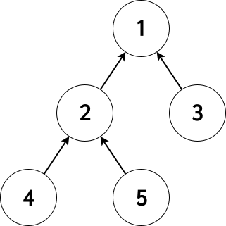

# บริษัท (ใดๆ)

ในบริษัทแห่งหนึ่ง มีพนักงานทั้งหมด $N$ คน เรียกเป็นพนักงานหมายเลขประจำตัว $1$ ถึง $N$ พนักงานทุกคนจะมีฐานะไม่เท่ากัน

บริษัทนี้ มีการจัดการภาระงานแบบเป็นลำดับชั้น นั่นคือ พนักงานแต่ละคนในบริษัท จะมีหัวหน้าโดยตรงของตนเอง $1$ คนพอดี ยกเว้นพนักงานคนเดียว(หมายเลขประจำตัว $1$) ที่ไม่มีหัวหน้าโดยตรงเลย เพราะเป็นผู้บริหารหลักของบริษัท

เนื่องจากไม่กี่วันที่ผ่านมา มีการสำรวจสถิติของบริษัท ซึ่งเป็นการสำรวจประชากรทั้งบริษัท ว่า \emph{พนักงานแต่ละคน มีหัวหน้าโดยอ้อมอยู่กี่คนที่มีฐานะยากจนกว่าตนเอง} เพื่อดำเนินการปรับปรุงการให้เงินเดือนและนโยบายในอนาคต

คุณต้องการทราบข้อมูลของบริษัทนี้ โดยอยากทราบว่าหากเรียงพนักงานตามฐานะ จากร่ำรวยที่สุด ไปจนถึงยากจนที่สุด จะมีหมายเลขประจำตัวพนักงานเป็นแบบใด เนื่องจากบางครั้งมีคำตอบได้หลายวิธี หากมีหลายวิธีให้แสดงข้อมูลแบบใดก็ได้ที่สอดคล้องกับข้อมูลสถิติ

รับประกันว่าข้อมูลสถิติจะไม่ขัดแย้งแน่นอน นั่นคือ มีคำตอบที่สอดคล้องอย่างน้อย 1 คำตอบเสมอ

## ข้อมูลนำเข้า

บรรทัดแรก ระบุจำนวนเต็มบวก $N$ แทนจำนวนพนักงานในบริษัท

บรรทัดที่สอง ระบุจำนวนเต็มไม่ลบทั้งหมด $N$ ตัว ตัวที่ $i$ แทนจำนวนหัวหน้าโดยอ้อมของคนที่ $i$ ที่มีฐานะยากจนกว่า $i$

ต่อมาอีก $N-1$ บรรทัด คือบรรทัดที่ $3$ ถึงบรรทัดที่ $N+1$ ในบรรทัดที่ $1+i$ จะเป็นจำนวนเต็มเพียงตัวเดียว แทนหมายเลขประจำตัวของพนักงานที่มีตำแหน่งเป็นหัวหน้าโดยตรงของพนักงานหมายเลข $i$

## ข้อมูลส่งออก

บรรทัดเดียว ระบุจำนวนเต็ม $N$ ตัว โดยเรียงฐานะของพนักงานในบริษัทจากร่ำรวยที่สุดไปจนถึงยากจนที่สุด

## การให้คะแนน

20\% ของชุดทดสอบมี $N \leq 10$

40\% ของชุดทดสอบมี $N \leq 300$

70\% ของชุดทดสอบมี $N \leq 2,000$

100\% ของชุดทดสอบมี $N \leq 300,000$

## ตัวอย่าง

ข้อมูลนำเข้า 1:

```
5
0 1 0 1 0
1
1
2
2
```

ข้อมูลส่งออก 1:

```
2 4 1 3 5
```

ข้อมูลนำเข้า 2:

```
7
0 1 0 0 0 2 0
3
1
7
6
2
2
```

ข้อมูลส่งออก 2:

```
1 6 2 3 7 4 5
```

ข้อมูลนำเข้า 3:

```
6
0 1 1 2 2 2
1
1
2
2
3
```

ข้อมูลส่งออก 3:

```
6 5 4 3 2 1
```

ข้อมูลนำเข้า 4:

```
5
0 1 1 3 2
1
2
3
4
```

ข้อมูลส่งออก 4:

```
4 2 5 3 1
```

ข้อมูลนำเข้า 5:

```
8
0 1 1 0 1 1 0 1
1
1
1
1
1
1
1
```

ข้อมูลส่งออก 5:

```
8 6 5 3 2 1 7 4
```

## คำอธิบาย

จะกล่าวว่าพนักงาน $A$ เป็นหัวหน้าโดยตรงของ $B$ ก็ต่อเมื่อ $B$ เป็นลูกน้องโดยตรงของ $A$

จะกล่าวว่าพนักงาน $A$ เป็นหัวหน้าโดยอ้อมของ $B$ เมื่อ $A$ เป็นหัวหน้าโดยตรงของ $B$ หรือ มี $C$ ที่ $A$ เป็นหัวหน้าโดยอ้อมของ $C$ และ $C$ เป็นหัวหน้าโดยอ้อมของ $B$

จะกล่าวว่า $A$ เป็นลูกน้องโดยอ้อมของ $B$ เมื่อ $B$ เป็นหัวหน้าโดยอ้อมของ $A$

พิจารณาตัวอย่างแรก จะมีโครงสร้างบริษัทดังนี้ (ตัวเลขบนจุดยอด แทนหมายเลขประจำตัวพนักงาน และลูกศรแทนความสัมพันธ์โดยตรง หาก ลูกศร $A \rightarrow B$ แสดงว่า $A$ เป็นลูกน้องโดยตรงของ $B$ หรืออาจกล่าวได้ว่า $B$ เป็นหัวหน้าโดยตรงของ $A$)

 <!-- Will be fixed soon -->

ข้อมูล `01010` หมายถึง

พนักงานคนที่ $1$ ไม่มีหัวหน้าทางอ้อมใดๆที่ยากจนกว่าตน

พนักงานคนที่ $2$ มีหัวหน้าทางอ้อม $1$ คนที่ยากจนกว่าตน

พนักงานคนที่ $3$ ไม่มีหัวหน้าทางอ้อมใดๆที่ยากจนกว่าตน

พนักงานคนที่ $4$ มีหัวหน้าทางอ้อม $1$ คนที่ยากจนกว่าตน

พนักงานคนที่ $5$ ไม่มีหัวหน้าทางอ้อมใดๆที่ยากจนกว่าตน

จากข้อมูล จะได้ว่าพนักงานหมายเลข $1$ จะยากจนกว่าหมายเลข $2$ อย่างแน่นอน และพนักงานหมายเลข $3$ จะยากจนกว่าพนักงานหมายเลข $1$ อย่างแน่นอน แต่สำหรับพนักงานคนที่ $4$ อาจเป็นพนักงานหมายเลข $1$ หรือหมายเลข $2$ ที่ยากจนกว่าตน คนใดคนหนึ่งเท่านั้น และสำหรับพนักงานคนที่ $5$ จะได้ว่ายากจนกว่าพนักงานคนที่ $1$ และ $2$ แน่ๆ คำตอบ `2 4 1 3 5` จึงเป็นคำตอบที่เป็นไปได้ (เรียงจากรวยที่สุดไปจนที่สุดเป็น `2 4 1 3 5`)

สำหรับตัวอย่างแรก อีกคำตอบที่เป็นไปได้คือ `2 4 1 5 3`

## ข้อจำกัด

Time Limit: 2 seconds

Memory Limit: 256 megabytes
